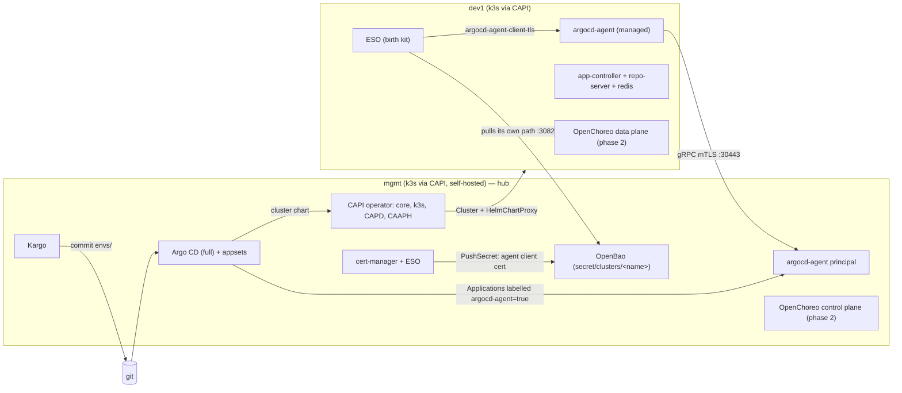

# platform-lab

Declarative multi-cluster Kubernetes lab: **Cluster API (k3s provider)** builds the fleet, **Argo CD + argocd-agent**
delivers to it, **Kargo** promotes across environments, **OpenChoreo** is the developer platform on top.



## Layout

Top-level folders under `repos/` simulate separate git repositories (split later without changing paths inside them).

| Path | Future repo | Owns |
|---|---|---|
| `bootstrap/` | platform-config | the only imperative bit: k3d → CAPI builds hub → `clusterctl move` → Argo CD + root app |
| `repos/platform-charts/` | one repo (or one per chart) | umbrella Helm charts, 1 per addon, + local charts `cluster`, `capi-providers` |
| `repos/platform-config/argocd/` | platform-config | AppProjects, ApplicationSets (root app points here) |
| `repos/platform-config/addons/{management,workers}/` | platform-config | which addon, which version, which values — per fleet / env / cluster |
| `repos/platform-config/fleet/` | platform-config | ClusterClasses, CAAPH HelmChartProxies, one file per cluster |
| `repos/platform-config/kargo/` | platform-config | Kargo projects, warehouses, stages |
| `repos/apps/` | app team repos | workloads: `chart/` + `envs/<env>/values.yaml` |

## How targeting works

`fleet/clusters/<env>/<name>.yaml` is the single source of truth for a cluster. The `cluster` chart stamps the same
`platform.lab/{name,env,role,provider,region}` labels on the CAPI `Cluster` **and** on the Argo CD cluster secret it
mints for the agent. ApplicationSets select on those labels:

| Scope | Where you change it |
|---|---|
| whole env (dev1, dev2, …) | `addons/workers/<addon>/envs/<env>.yaml` → `rollout.chartRevision`; values in `envs/<env>.values.yaml` |
| one cluster | same file → `rollout.clusters.<cluster>.chartRevision`; values in `clusters/<cluster>.values.yaml` |
| whole fleet | `addons/workers/<addon>/values.yaml`, or the chart itself |
| apps | `repos/apps/<app>/envs/<env>/values.yaml` (Kargo writes), `clusters/<cluster>/values.yaml` for one cluster |

Enable/disable anything file-driven by renaming `*.yaml` ⇄ `*.yaml.disabled` (test1, prod1, dev2, OpenChoreo, Istio ship disabled).

## Run

```bash
# 0. push this repo, then point manifests at it (default: github.com/koorikla/platform-lab)
make set-repo REPO=https://github.com/<you>/<repo>.git && git commit -am "set repo" && git push
# 1. needs: docker, k3d, kubectl, helm, clusterctl
make up        # k3d bootstrap -> CAPI creates hub 'mgmt' -> clusterctl move (hub manages itself) -> Argo CD
make status
make ui        # Argo CD :8080 (admin / make argocd-password), Kargo :8081 (admin / make kargo-password)
make kubeconfig CLUSTER=dev1 > dev1.kubeconfig
```

Linux hosts running several CAPD clusters usually need
`sysctl fs.inotify.max_user_watches=1048576 fs.inotify.max_user_instances=8192`.

Kargo needs git push credentials: `hack/kargo-deploy-key.sh` (repo-scoped deploy key, straight into a hub Secret).

## Working on this repo

Backlog = [GitHub issues](https://github.com/koorikla/platform-lab/issues). How work flows (claim → worktree branch →
tests → PR → review → live verification under `hack/lab-lock.sh`) and recipes for adding a cluster, addon, app or
provider: [CONTRIBUTING.md](CONTRIBUTING.md). Agents use the skill in
[`.claude/skills/platform-lab-issue`](.claude/skills/platform-lab-issue/SKILL.md). Invariants: [CLAUDE.md](CLAUDE.md).

## Status

Boots end to end on Docker Desktop (CAPI pivot + agent path verified). Open items are GitHub issues; `grep -rn VERIFY repos/` lists values still inferred rather than confirmed. Needs ~8 GB RAM and ≥25 GB free Docker disk for hub + one worker.
